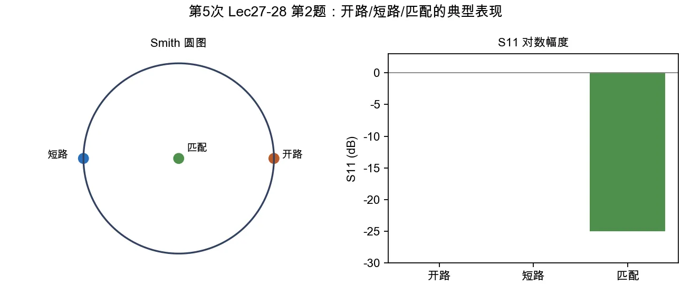

# 第 2 题：微带开路、短路、匹配状态的 VNA 表现

> 对应知识点：[04-微波测量与课程综合](../../../knowledge/08-谐振器网络与课程综合/04-微波测量与课程综合.md)

**题目**：微带线终端开路、短路、匹配时，在 Smith 圆图和 \(S_{11}\) 对数幅度上分别有何典型表现？如何从图上理解 \(\lambda/4\) 阻抗变换？

*图：开路和短路都在 Smith 圆图外圆附近，区别主要是相位；匹配状态靠近圆心，\(S_{11}\) 对数幅度明显降低。*

## 一、三种终端表现

| 终端 | Smith 圆图 | \(S_{11}\) 对数幅度 |
|------|------------|--------------------|
| 开路 | 轨迹在外圆附近，理想开路在右端点附近；随频率沿外圆旋转 | 接近 \(0\,\mathrm{dB}\)，表示几乎全反射 |
| 短路 | 轨迹在外圆附近，理想短路在左端点附近；与开路相差约 \(180^\circ\) | 接近 \(0\,\mathrm{dB}\)，也表示几乎全反射 |
| 匹配 | 靠近圆心 | \(S_{11}\) 很低，常见目标为低于 \(-20\,\mathrm{dB}\) |

## 二、\(\lambda/4\) 阻抗变换的图像

沿无耗传输线移动长度 \(l\)，反射系数相位会旋转 \(2\beta l\)。当

\[
l=\frac{\lambda}{4},
\]

有

\[
2\beta l=2\cdot\frac{2\pi}{\lambda}\cdot\frac{\lambda}{4}=\pi.
\]

也就是 Smith 圆图上沿等 \(|\Gamma|\) 圆旋转 \(180^\circ\)。因此：

- 负载端开路，经过 \(\lambda/4\) 后输入端表现为短路；
- 负载端短路，经过 \(\lambda/4\) 后输入端表现为开路。

## 三、结论与易错点

开路和短路都属于高反射，区别主要在相位；匹配状态靠近圆心。 \(\lambda/4\) 变换不是让反射变小，而是把反射系数相位转半圈，使开路/短路在输入端互换。
