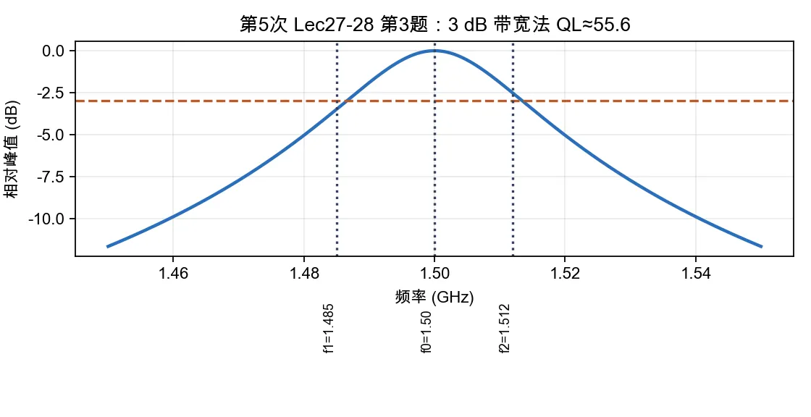

# 第 3 题：3 dB 带宽法求有载品质因数

> 对应知识点：[04-微波测量与课程综合](../../../knowledge/08-谐振器网络与课程综合/04-微波测量与课程综合.md)

**题目**：测量某谐振器得到 \(f_0=1.50\,\mathrm{GHz}\)，\(f_1=1.485\,\mathrm{GHz}\)，\(f_2=1.512\,\mathrm{GHz}\)，求有载品质因数 \(Q_L\)；说明仪器自动带宽搜索与手动光标读数可能不同的原因。

*图：以峰值下降 3 dB 的两个频点定义带宽 \(\Delta f=f_2-f_1\)，由 \(Q_L=f_0/\Delta f\) 得到有载品质因数。*

## 一、计算 \(Q_L\)

3 dB 带宽法：

\[
Q_L=\frac{f_0}{f_2-f_1}.
\]

带宽为

\[
\Delta f=f_2-f_1=1.512-1.485=0.027\,\mathrm{GHz}.
\]

所以

\[
Q_L=\frac{1.50}{0.027}\approx55.6.
\]

\[
\boxed{Q_L\approx55.6}
\]

## 二、自动搜索与手动读数不同的原因

可能原因包括：

1. **频率点离散**：手动光标只能落在采样点附近，自动算法可能做插值。
2. **参考峰值不同**：自动搜索会先找峰值再找 \(-3\,\mathrm{dB}\) 点；手动读数若峰值没对准，会整体偏移。
3. **扫频范围和点数不足**：频率分辨率不够时，两个 3 dB 点误差会被放大到 \(Q_L\)。
4. **噪声和平均因子**：峰值附近有噪声时，自动算法和人工判断的交点不同。
5. **曲线不对称或耦合影响**：实际谐振峰不一定是理想洛伦兹线型。

## 三、结论与易错点

本题测得的是有载品质因数 \(Q_L\)，不是无载品质因数 \(Q_0\)。若要减小读数差异，应缩小扫频范围、增加扫频点数、开启适当平均，并保持同一峰值参考。
