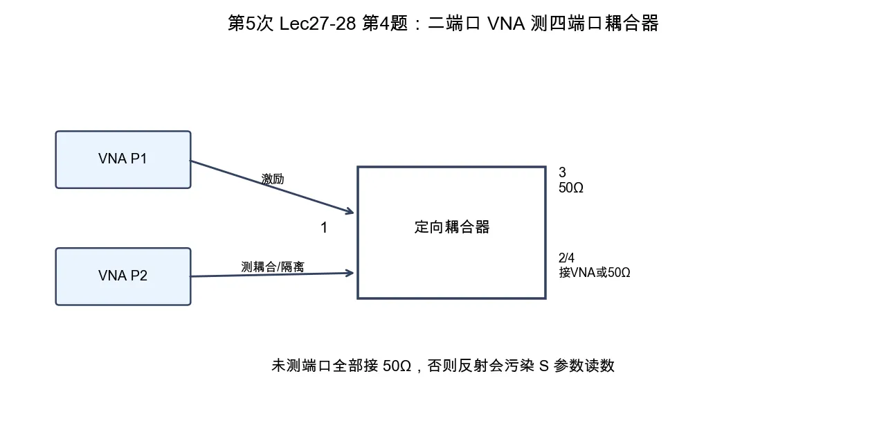

# 第 4 题：二端口 VNA 测定向耦合器方向性和隔离度

> 对应知识点：[04-微波测量与课程综合](../../../knowledge/08-谐振器网络与课程综合/04-微波测量与课程综合.md)

**题目**：设计一份用二端口 VNA 测量定向耦合器方向性和隔离度的接线方案，说明每次未测端口为什么必须接 \(50\,\Omega\) 匹配负载。

*图：二端口 VNA 每次只测一个端口对；其余端口必须接 \(50\,\Omega\) 匹配负载，才能满足 \(S\) 参数定义。*

## 一、端口约定

按大纲常用约定：

- 端口 1：输入端；
- 端口 3：直通端；
- 端口 2：耦合端；
- 端口 4：隔离端。

指标为

\[
C=-20\log|S_{21}|,\qquad
I=-20\log|S_{41}|,\qquad
D=I-C.
\]

## 二、测量耦合度 \(C\)

接线：

1. VNA 端口 1 接耦合器端口 1；
2. VNA 端口 2 接耦合器端口 2；
3. 耦合器端口 3、4 接 \(50\,\Omega\) 匹配负载；
4. 测量 \(S_{21}\)，得到耦合端输出。

由 \(S_{21}\) 算耦合度 \(C\)。

## 三、测量隔离度 \(I\)

接线：

1. VNA 端口 1 仍接耦合器端口 1；
2. VNA 端口 2 改接耦合器端口 4；
3. 耦合器端口 2、3 接 \(50\,\Omega\) 匹配负载；
4. 测量 \(S_{41}\)，得到隔离端泄漏。

由 \(S_{41}\) 算隔离度 \(I\)，再由

\[
D=I-C
\]

得到方向性。

## 四、为什么未测端口必须匹配

\(S\) 参数定义要求除激励端口外，未激励端口没有入射波。未测端口若悬空、短路或接错负载，会把到达该端口的波反射回耦合器，形成二次耦合和多次反射，测到的就不是单纯的 \(S_{21}\) 或 \(S_{41}\)。

## 五、结论与易错点

用二端口 VNA 测四端口器件时，一次只能测一个端口对，其余端口必须接 \(50\,\Omega\) 匹配负载。方向性不是直接读一个曲线，而是由隔离度和耦合度相减得到。
