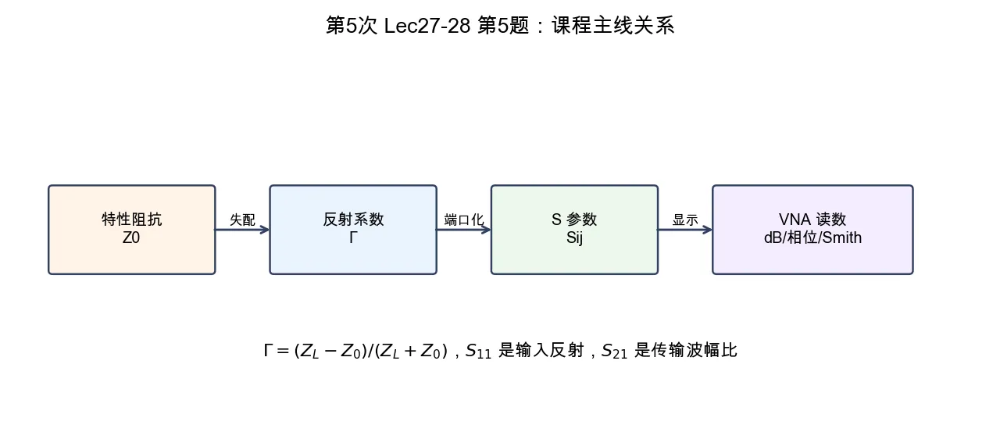

# 第 5 题：特性阻抗、反射系数、\(S\) 参数和测量读数的关系

> 对应知识点：[04-微波测量与课程综合](../../../knowledge/08-谐振器网络与课程综合/04-微波测量与课程综合.md)

**题目**：用一段话总结本课程中“特性阻抗—反射系数—\(S\) 参数—测量读数”的关系，要求写清每个量的物理对象和适用场景。

*图：\(Z_0\) 定义匹配参考，\(\Gamma\) 描述反射，\(S_{ij}\) 统一端口反射和传输，VNA 把复数 \(S\) 参数显示成 dB、相位、Smith 圆图等读数。*

## 标准解答

特性阻抗 \(Z_0\) 是传输线或测量系统的参考阻抗，规定了什么叫匹配；负载阻抗 \(Z_L\) 与 \(Z_0\) 不相等时，会产生反射系数

\[
\Gamma=\frac{Z_L-Z_0}{Z_L+Z_0}.
\]

在二端口或多端口网络中，反射和传输统一写成 \(S\) 参数：\(S_{11}\) 是端口 1 的输入反射系数，\(S_{21}\) 是从端口 1 到端口 2 的传输波幅比。VNA 实际测量的是复数 \(S_{ij}\)，屏幕上常把它显示成 dB、相位、Smith 圆图或驻波比，其中

\[
S_{ij}[\mathrm{dB}]=20\log_{10}|S_{ij}|.
\]

因此，纸面上的 \(Z_0\)、\(\Gamma\)、\(S\) 参数和屏幕读数是同一件事的不同表达：先由参考阻抗定义反射，再由端口网络统一描述反射和传输，最后由仪器把复数波幅比显示成工程读数。

## 易错点

- \(\Gamma\) 是反射波/入射波的比值，不是功率比。
- \(S_{11}\) 在端口匹配参考下就是输入反射系数。
- dB 读数不是新物理量，只是对 \(|S_{ij}|\) 或功率比的对数表达。
